# laravel-project
## use-case
### questions
```
- is there someone have access to create an admin account ?
- how to manage forgot password requested ? (auto mail, manually mail...)
- is the website have a public home page for annonces and banners ... ?
- is there any category of notifications require a response ?
- what tasks can super-admin and limited-admin do ?
- who has access to create categories and types ?
```
### diagram

```mermaid
flowchart LR;
    %% login side
        user{{user}}---login;
        user---forpass[forgot password];
        admin{{admin}}---login;
        admin---forpass;
        ladmin{{limited admin}}---login;
        ladmin---forpass;
        sadmin{{super admin}}---login;
        forpass-->|include|login;
        reminder-.->|extend|login;
        login-->|include|captcha;
        login---->|include|auth[(authentification)];
        login----mp[main page];
        ladmin---signup;
        admin---signup;
    %% main page side
        mp---profile;
        mp---settings;
        mp---notifications;
        mp---requests;
        mp---logout;
        user-----documents;
        documents-->|include|mp;
        admin-----filières;
        filières-->|include|mp;
        admin-----groups;
        groups-->|include|mp;
        admin-----users;
        users-->|include|mp;
        sadmin-----admins;
        admins-->|include|mp;
        admin-----uploads;
        uploads-->|include|mp;
    %% settings side
        settings---pm[profile management];
        pm---avatar;
        pm---np[phone number];
        pm---email;
        settings---preferences;
        preferences---language;
        preferences---mode;
        mode---default;
        mode---white;
        mode---dark;
        settings---ps[password & security];
    %% notifications side
        notifications---nc[create];
        nc---nsc[select categorie];
        nc---nsm[select mode];
        nsm---ncn[niveau];
        nsm---ncf[filière];
        nsm---ncg[group];
        nsm---ncs[user];
        nsm---nca[admin];
        text-.->|extend|nc;
        nud[upload documents]-.->|extend|nc;
        notifications---nrr[recherche];
        notifications---nr[read];
        nr---nddd[download documents];
        nr---nmau[mark as unread];
        notifications---nu[update];
        notifications---nd[delete];
        nr & nu & nd-->|include|ns[select notification];
        admin-----categories;
        categories-->|include|notifications;
        %% categories side
            categories---cc[create];
            categories---crr[recherche];
            categories---cr[read];
            categories---cu[update];
            categories---cd[delete];
            cr & cu & cd-->|include|nsc;
    %% requests side
        user & admin & ladmin & sadmin-----rc[create];
        rc---rst[select type];
        user & admin & ladmin & sadmin-----rd[delete];
        rc & rd-->|include|requests;
        requests---rrr[recherche];
        requests---rr[read];
        admin-----ru[update];
        sadmin-----ru;
        admin-----rre[redirect request];
        ru---rcs[change state];
        ru & rre-->|include|requests;
        admin-----types;
        types-->|include|requests;
        rr & ru & rd & rre-->|include|rs[select request];
        signup-->|include|rc;
        %% types side
            types---tc[create];
            types---trr[recherche];
            types---tr[read];
            types---tu[update];
            types---td[delete];
            tr & tu & td-->|include|rst;
    %% filières side
        filières---fc[create];
        filières---frr[recherche];
        filières---fr[read];
        filières---fu[update];
        filières---fd[delete];
        fr & fu & fd-->|include|fs[select filière];
    %% groups side
        groups---gc[create];
        groups---grr[recherche];
        groups---gr[read];
        groups---gu[update];
        groups---gd[delete];
        gr & gu & gd-->|include|gs[select group];
    %% users side
        users---uc[create];
        users---urr[recherche];
        users---ur[read];
        users---uu[update];
        users---ud[delete];
        ur & uu & ud-->|include|us[select user];
    %% admins side
        admins---arr[recherche];
        admins---ar[read];
        admins---au[update];
        admins---ad[delete];
        ar & au & ad-->|include|as[select admin];
    %% uploads side
        uploads---uprr[recherche];
        uploads---ups[select rows];
        uploads---upu[update];
        uploads---upd[delete];
        uploads---upi[insert];
        upu & upd & upi-->|include|ups;
        toi[type of insert]-->|include|upi;
        toi---ibf[by filière];
        toi---ibg[by group];
        toi---ibu[by user];
        syi[year]-->|include|upi;
```

