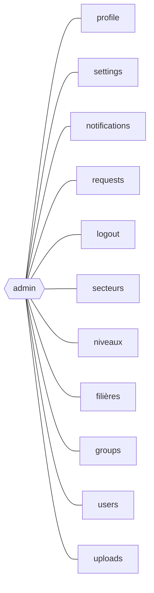
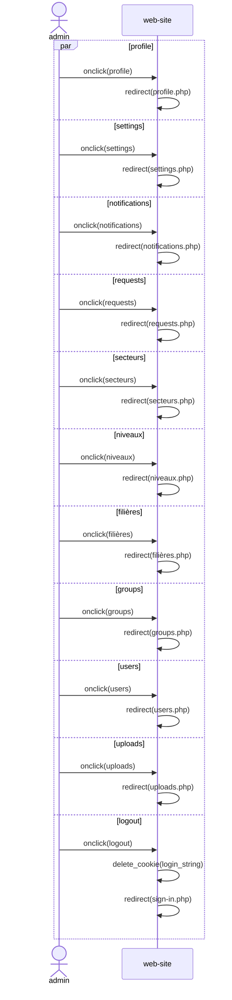

## use-case

```mermaid
graph LR
    admin{{admin}} --- profile & settings & notifications & requests & logout & secteurs & niveaux & filières & groups & users & uploads
    
    %% links
    
```
## sequence

```mermaid
sequenceDiagram
    actor admin
    participant site as web-site
    par profile
        admin ->> site : onclick(profile)
        site ->> site : redirect(profile.php)
    and settings
        admin ->> site : onclick(settings)
        site ->> site : redirect(settings.php)
    and notifications
        admin ->> site : onclick(notifications)
        site ->> site : redirect(notifications.php)
    and requests
        admin ->> site : onclick(requests)
        site ->> site : redirect(requests.php)
    and secteurs
        admin ->> site : onclick(secteurs)
        site ->> site : redirect(secteurs.php)
    and niveaux
        admin ->> site : onclick(niveaux)
        site ->> site : redirect(niveaux.php)
    and filières
        admin ->> site : onclick(filières)
        site ->> site : redirect(filières.php)
    and groups
        admin ->> site : onclick(groups)
        site ->> site : redirect(groups.php)
    and users
        admin ->> site : onclick(users)
        site ->> site : redirect(users.php)
    and uploads
        admin ->> site : onclick(uploads)
        site ->> site : redirect(uploads.php)
    and logout
        admin ->> site : onclick(logout)
        site ->> site : delete_cookie(login_string)
        site ->> site : redirect(sign-in.php)
    end
```
