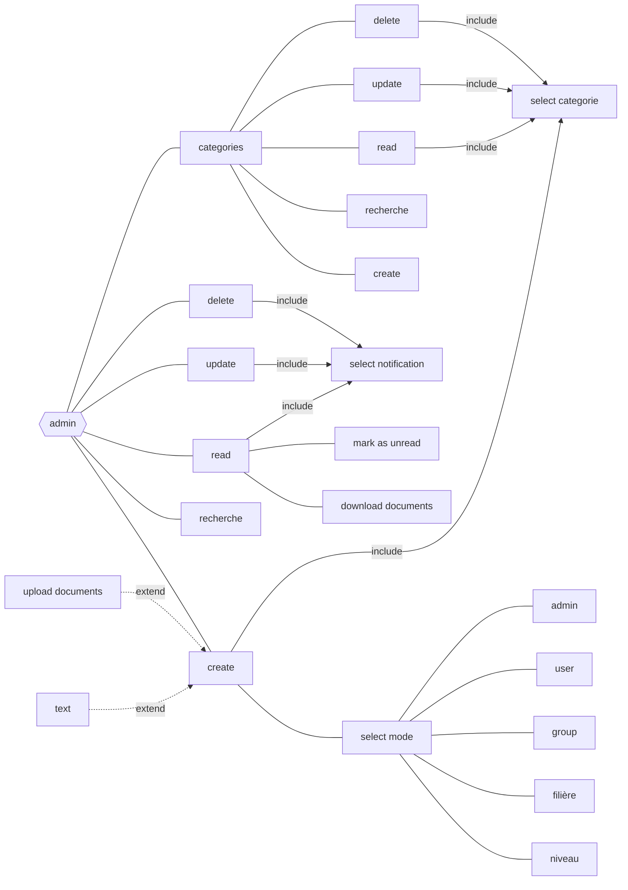

## use-case

```mermaid
graph LR
    admin{{admin}} --- nc[create] & nrr[recherche] & nr[read] & nu[update] & nd[delete] & categories
    nc --- nsm[select mode]
    nsm --- ncn[niveau] & ncf[filière] & ncg[group] & ncs[user] & nca[admin]
    text & nud[upload documents] -.-> |extend| nc
    nr --- nddd[download documents] & nmau[mark as unread]
    nr & nu & nd --> |include| ns[select notification]
    categories --- cc[create] & crr[recherche] & cr[read] & cu[update] & cd[delete]
    nc & cr & cu & cd --> |include| nsc[select categorie]
```
