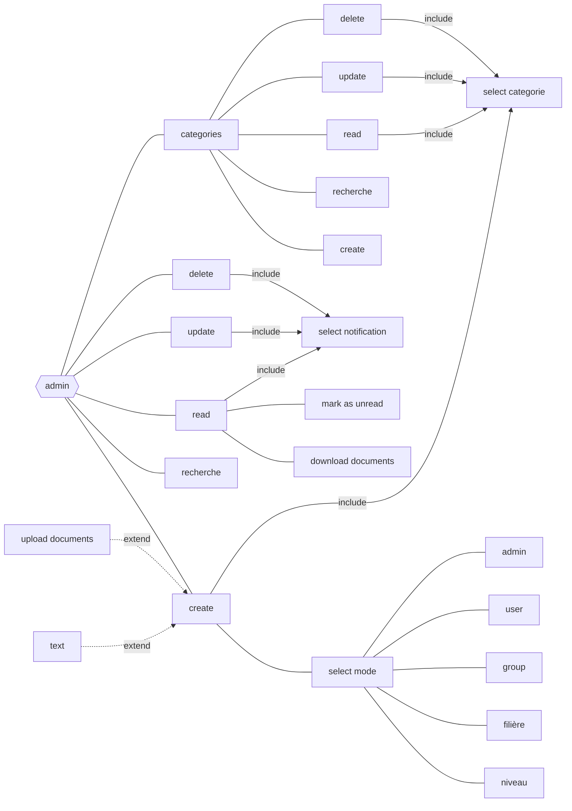
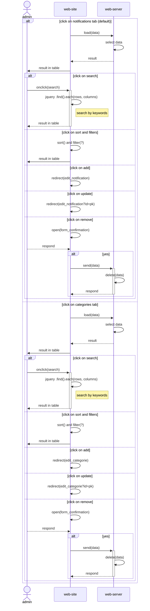

## use-case

```mermaid
graph LR
    admin{{admin}} --- nc[create] & nrr[recherche] & nr[read] & nu[update] & nd[delete] & categories
    nc --- nsm[select mode]
    nsm --- ncn[niveau] & ncf[filière] & ncg[group] & ncs[user] & nca[admin]
    text & nud[upload documents] -.-> |extend| nc
    nr --- nddd[download documents] & nmau[mark as unread]
    nr & nu & nd --> |include| ns[select notification]
    categories --- cc[create] & crr[recherche] & cr[read] & cu[update] & cd[delete]
    nc & cr & cu & cd --> |include| nsc[select categorie]
```
## sequence

```mermaid
sequenceDiagram
    actor admin
    participant site as web-site
    participant server as web-server
    alt click on notifications tab (default)
        site ->> server : load(data)
        server ->> server : select data
        server -->> site : result
        site ->> admin : result in table
        alt click on search
            admin ->>+ site : onclick(search)
            site ->> site : jquery .find().each(rows, columns)
            note right of site : search by keywords
            site -->>- admin : result in table
        else click on sort and filters
            site ->> site : sort() and filter(?)
            site ->> admin : result in table
        else click on add
            site ->> site : redirect(edit_notification)
        else click on update
            site ->> site : redirect(edit_notification?id=pk)
        else click on remove
            site ->> site : open(form_confirmation)
            admin -->> site : respond
            alt yes
                site ->>+ server : send(data)
                server ->> server : delete(data)
                server -->>- site : respond
            end
        end
    else click on categories tab
        site ->> server : load(data)
        server ->> server : select data
        server -->> site : result
        site ->> admin : result in table
        alt click on search
            admin ->>+ site : onclick(search)
            site ->> site : jquery .find().each(rows, columns)
            note right of site : search by keywords
            site -->>- admin : result in table
        else click on sort and filters
            site ->> site : sort() and filter(?)
            site ->> admin : result in table
        else click on add
            site ->> site : redirect(edit_categorie)
        else click on update
            site ->> site : redirect(edit_categorie?id=pk)
        else click on remove
            site ->> site : open(form_confirmation)
            admin -->> site : respond
            alt yes
                site ->>+ server : send(data)
                server ->> server : delete(data)
                server -->>- site : respond
            end
        end
    end
```
