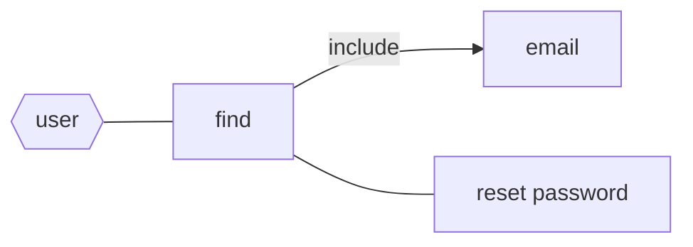
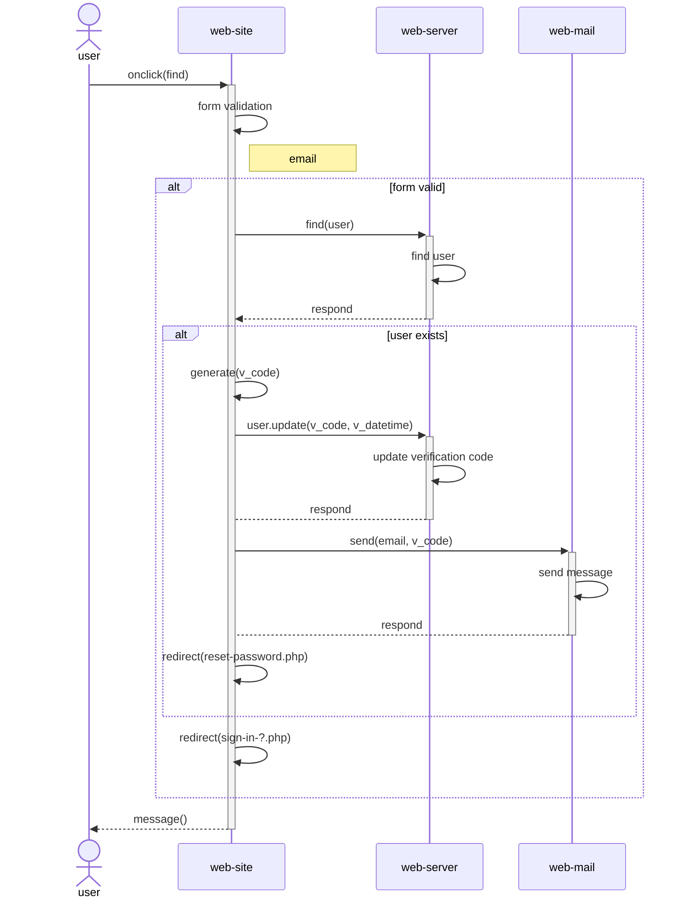

## use-case

```mermaid
graph LR
    user{{user}} --- find
    find --> |include| email
    find --- r-password[reset password]
    
    %% links
    click r-password "https://github.com/idlli/laravel-project/blob/main/diagrams/login/reset-password.md" _blank
```
## sequence

```mermaid
sequenceDiagram
    actor user
    participant site as web-site
    participant server as web-server
    participant mail as web-mail
    user ->>+ site : onclick(find)
    site ->> site : form validation
    note right of site : email
    alt form valid
        site ->>+ server : find(user)
        server ->> server : find user
        server -->>- site : respond
        alt user exists
            site ->> site : generate(v_code)
            site ->>+ server : user.update(v_code, v_datetime)
            server ->> server : update verification code
            server -->- site : respond
            site ->>+ mail : send(email, v_code)
            mail ->> mail : send message
            mail -->- site : respond
            site ->> site : redirect(reset-password.php)
        end
        site ->> site : redirect(sign-in-?.php)
    end
    site -->>- user : message()
```
