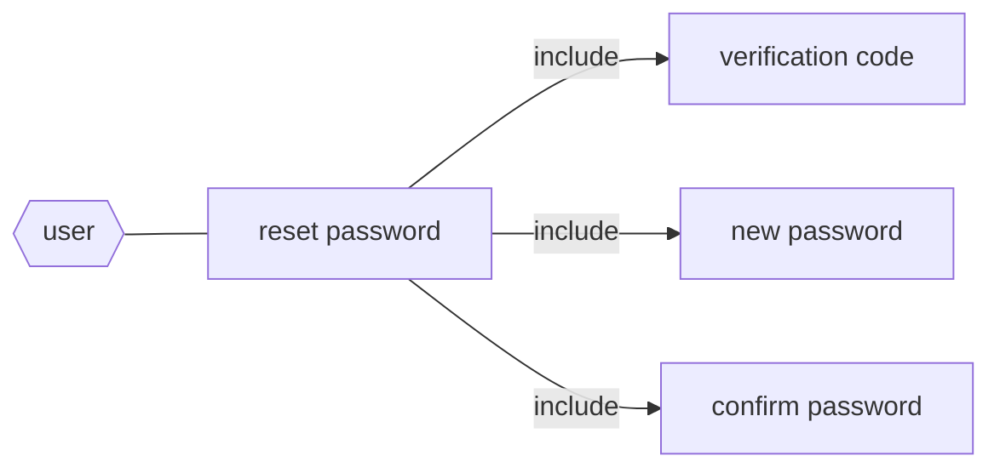
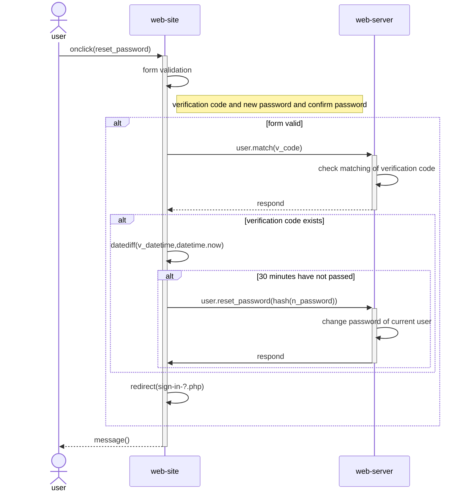

## use-case

```mermaid
graph LR
    user{{user}} --- r-password[reset password]
    r-password --> |include| v-code[verification code] & n-password[new password] & c-password[confirm password]
```
## sequence

```mermaid
sequenceDiagram
    actor user
    participant site as web-site
    participant server as web-server
    user ->>+ site : onclick(reset_password)
    site ->> site : form validation
    note right of site : verification code and new password and confirm password
    alt form valid
        site ->>+ server : user.match(v_code)
        server ->> server : check matching of verification code
        server -->>- site : respond
        alt verification code exists
            site ->> site : datediff(v_datetime,datetime.now)
            alt 30 minutes have not passed
                site ->>+ server : user.reset_password(hash(n_password))
                server ->> server : change password of current user
                server ->>- site : respond
            end
        end
        site ->> site : redirect(sign-in-?.php)
    end
    site -->>- user : message()
```
