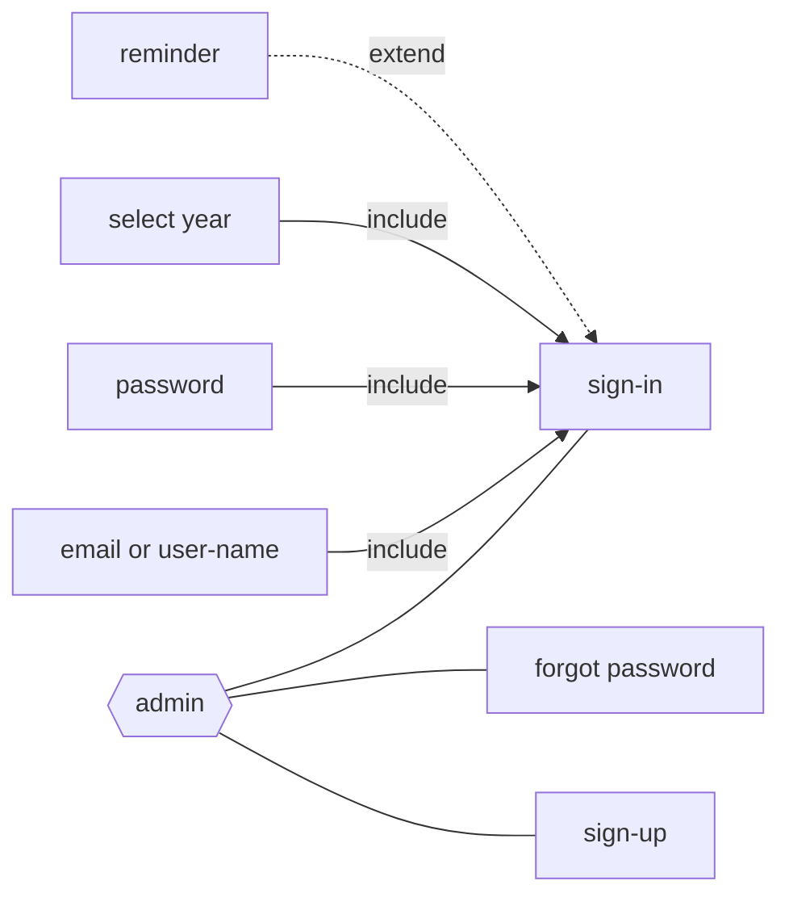
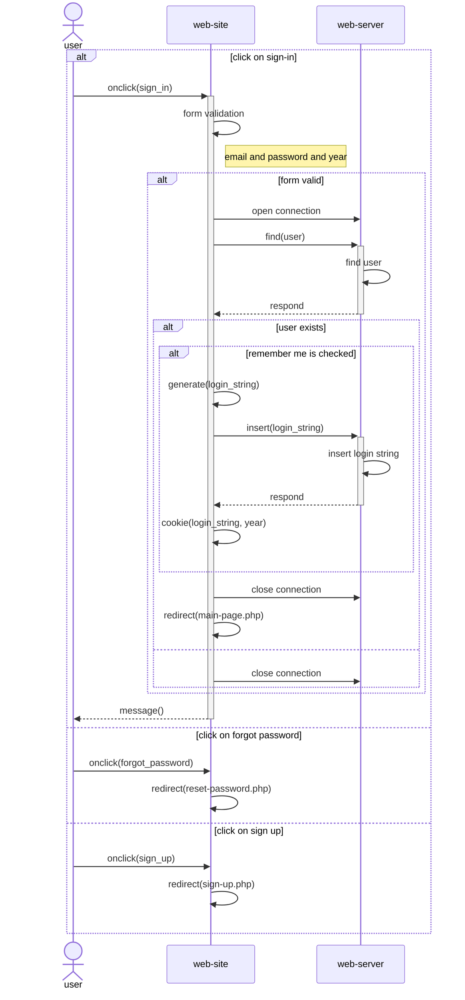

## use-case

```mermaid
graph LR
    admin{{admin}} --- sign-in & f-password[forgot password] & sign-up
    email[email or user-name] & password & s-year[select year] --> |include| sign-in
    reminder -.-> |extend| sign-in
    
    %% links
    click f-password "https://github.com/idlli/laravel-project/blob/main/diagrams/login/reset-password.md" _blank
    click sign-up "https://github.com/idlli/laravel-project/blob/main/diagrams/login/sign-up.md" _blank
```
## sequence

```mermaid
sequenceDiagram
    actor user
    participant site as web-site
    participant server as web-server
    alt click on sign-in
        user ->>+ site : onclick(sign_in)
        site ->> site : form validation
        note right of site : email and password and year
        alt form valid
            site ->> server : open connection
            site ->>+ server : find(user)
            server ->> server : find user
            server -->>- site : respond
            alt user exists
                alt remember me is checked
                    site ->> site : generate(login_string)
                    site ->>+ server : insert(login_string)
                    server ->> server : insert login string
                    server -->>- site : respond
                    site ->> site : cookie(login_string, year)
                end
                site ->> server : close connection
                site ->> site : redirect(main-page.php)
            else
                site ->> server : close connection
            end
        end
        site -->>- user : message()
    else click on forgot password
        user ->> site : onclick(forgot_password)
        site ->> site : redirect(reset-password.php)
    else click on sign up
        user ->> site : onclick(sign_up)
        site ->> site : redirect(sign-up.php)
    end
```
