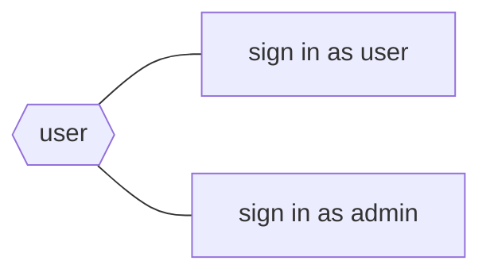
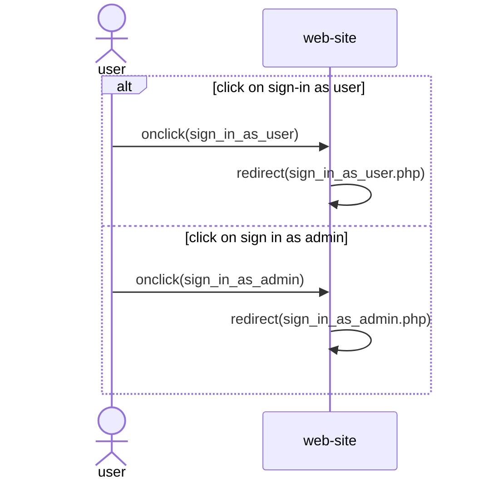

## use-case

```mermaid
graph LR
    user{{user}} --- sign-in-as-user[sign in as user] & sign-in-as-admin[sign in as admin]
    
    %% links
    click sign-in-as-user "https://github.com/idlli/laravel-project/blob/main/diagrams/login/sign-in-as-user.md" _blank
    click sign-in-as-admin "https://github.com/idlli/laravel-project/blob/main/diagrams/login/sign-in-as-admin.md" _blank
```
## sequence

```mermaid
sequenceDiagram
    actor user
    participant site as web-site
    alt click on sign-in as user
        user ->> site : onclick(sign_in_as_user)
        site ->> site : redirect(sign_in_as_user.php)
    else click on sign in as admin
        user ->> site : onclick(sign_in_as_admin)
        site ->> site : redirect(sign_in_as_admin.php)
    end
```
