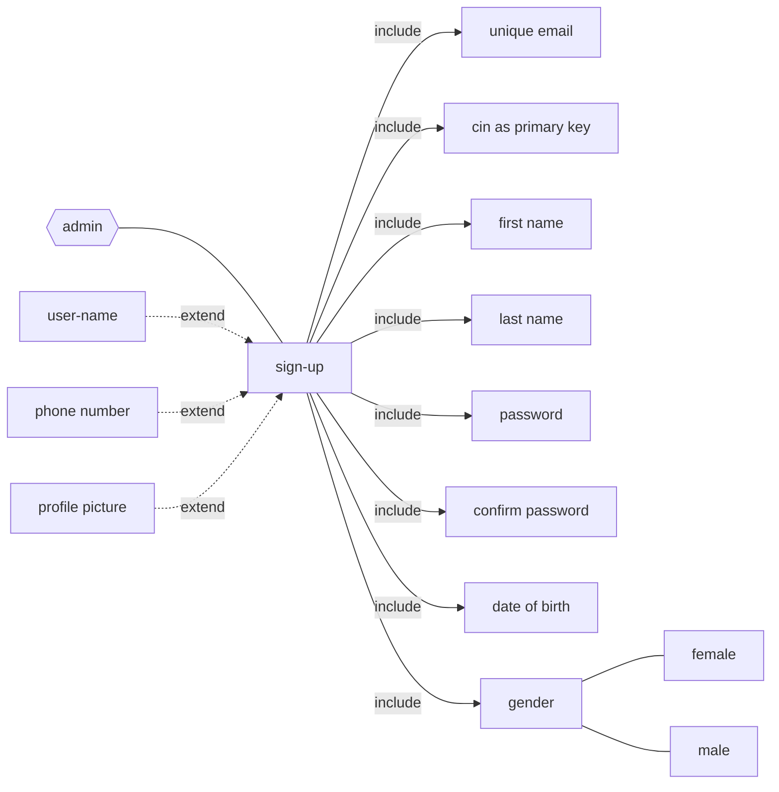
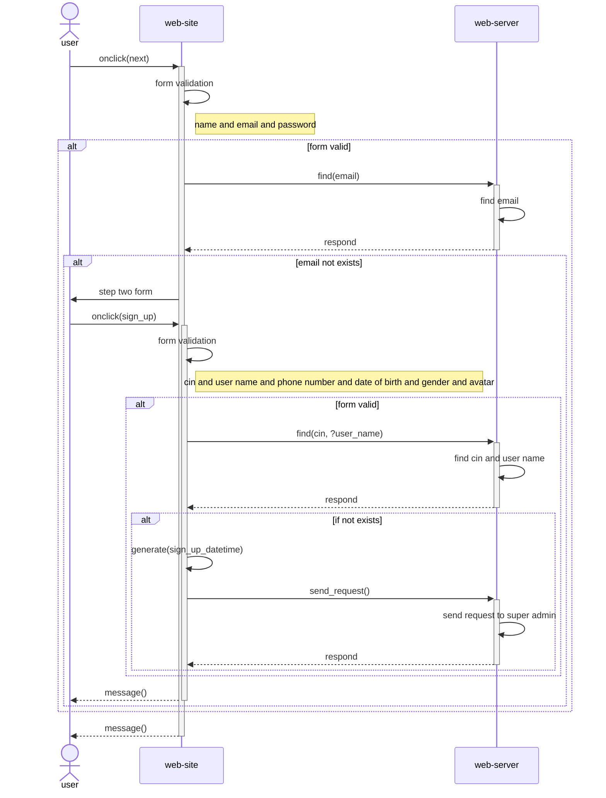

## use-case

```mermaid
graph LR
    admin{{admin}} --- sign-up
    sign-up --> |include| email[unique email] & cin[cin as primary key] & f-name[first name] & l-name[last name] & password & c-password[confirm password] & d-birth[date of birth] & gender
    gender --- female & male    
    u-name[user-name] & p-number[phone number] & avatar[profile picture] -.-> |extend| sign-up
    
    %% EFP ?
```
## sequence

```mermaid
sequenceDiagram
    actor user
    participant site as web-site
    participant server as web-server
    user ->>+ site : onclick(next)
    site ->> site : form validation
    note right of site : name and email and password
    alt form valid
        site ->>+ server : find(email)
        server ->> server : find email
        server -->>- site : respond
        alt email not exists
            site ->> user : step two form
            user ->>+ site : onclick(sign_up)
            site ->> site : form validation
            note right of site : cin and user name and phone number and date of birth and gender and avatar
            alt form valid
                site ->>+ server : find(cin, ?user_name)
                server ->> server : find cin and user name
                server -->>- site : respond
                alt if not exists
                    site ->> site : generate(sign_up_datetime)
                    site ->>+ server : send_request()
                    server ->> server : send request to super admin
                    server -->>- site : respond
                end
            end
            site -->>- user : message()
        end
    end
    site -->>- user : message()
```
