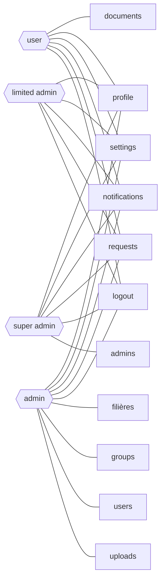

## use-case

```mermaid
graph LR
    user{{user}} --- documents
    user & admin{{admin}} & l-admin{{limited admin}} & s-admin{{super admin}} --- profile & settings & notifications & requests & logout
    admin --- filières & groups & users & uploads
    s-admin --- admins
```
