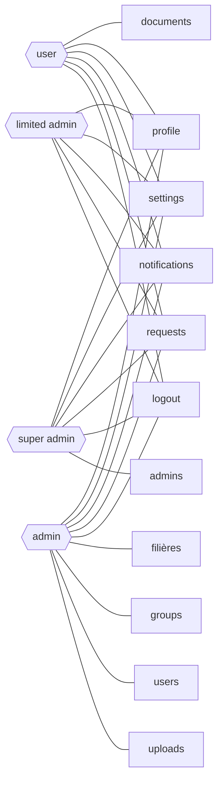

## use-case

```mermaid
graph LR
    user{{user}} --- documents
    user & admin{{admin}} & l-admin{{limited admin}} & s-admin{{super admin}} --- profile & settings & notifications & requests & logout
    admin --- filières & groups & users & uploads
    s-admin --- admins
    
    %% links
    click profile "https://github.com/idlli/laravel-project/diagrams/profile.md" _blank
    click settings "https://github.com/idlli/laravel-project/diagrams/settings.md" _blank
    click notifications "https://github.com/idlli/laravel-project/diagrams/notifications.md" _blank
    click requests "https://github.com/idlli/laravel-project/diagrams/requests.md" _blank
    click filières "https://github.com/idlli/laravel-project/diagrams/filières.md" _blank
    click groups "https://github.com/idlli/laravel-project/diagrams/groups.md" _blank
    click users "https://github.com/idlli/laravel-project/diagrams/users.md" _blank
    click uploads "https://github.com/idlli/laravel-project/diagrams/uploads.md" _blank
    click admins "https://github.com/idlli/laravel-project/diagrams/admins.md" _blank
```
