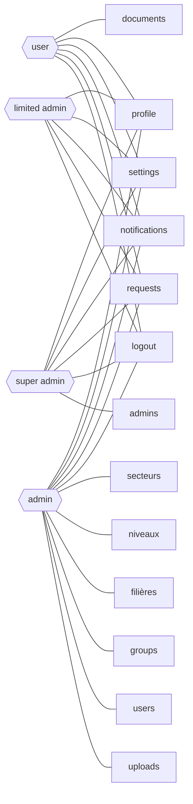
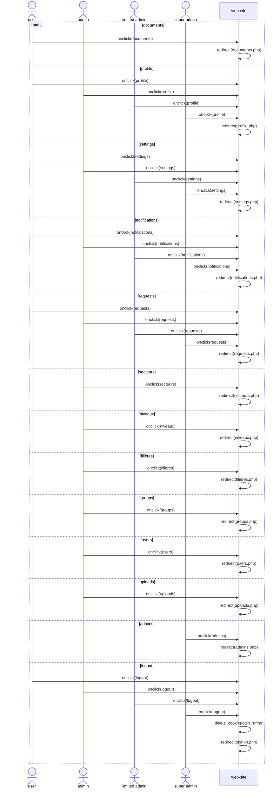

## use-case

```mermaid
graph LR
    user{{user}} --- documents
    user & admin{{admin}} & l-admin{{limited admin}} & s-admin{{super admin}} --- profile & settings & notifications & requests & logout
    admin --- secteurs & niveaux & filières & groups & users & uploads
    s-admin --- admins
    
    %% links
    click settings "https://github.com/idlli/laravel-project/blob/main/diagrams/settings.md" _blank
    click notifications "https://github.com/idlli/laravel-project/blob/main/diagrams/notifications.md" _blank
    click requests "https://github.com/idlli/laravel-project/blob/main/diagrams/requests.md" _blank
    click secteurs "https://github.com/idlli/laravel-project/blob/main/diagrams/secteurs.md" _blank
    click niveaux "https://github.com/idlli/laravel-project/blob/main/diagrams/niveaux.md" _blank
    click filières "https://github.com/idlli/laravel-project/blob/main/diagrams/filières.md" _blank
    click groups "https://github.com/idlli/laravel-project/blob/main/diagrams/groups.md" _blank
    click users "https://github.com/idlli/laravel-project/blob/main/diagrams/users.md" _blank
    click uploads "https://github.com/idlli/laravel-project/blob/main/diagrams/uploads.md" _blank
    click admins "https://github.com/idlli/laravel-project/blob/main/diagrams/admins.md" _blank
```
## sequence

```mermaid
sequenceDiagram
    actor user
    actor admin
    actor ladmin as limited admin
    actor sadmin as super admin
    participant site as web-site
    par documents
        user ->> site : onclick(documents)
        site ->> site : redirect(documents.php)
    and profile
        user ->> site : onclick(profile)
        admin ->> site : onclick(profile)
        ladmin ->> site : onclick(profile)
        sadmin ->> site : onclick(profile)
        site ->> site : redirect(profile.php)
    and settings
        user ->> site : onclick(settings)
        admin ->> site : onclick(settings)
        ladmin ->> site : onclick(settings)
        sadmin ->> site : onclick(settings)
        site ->> site : redirect(settings.php)
    and notifications
        user ->> site : onclick(notifications)
        admin ->> site : onclick(notifications)
        ladmin ->> site : onclick(notifications)
        sadmin ->> site : onclick(notifications)
        site ->> site : redirect(notifications.php)
    and requests
        user ->> site : onclick(requests)
        admin ->> site : onclick(requests)
        ladmin ->> site : onclick(requests)
        sadmin ->> site : onclick(requests)
        site ->> site : redirect(requests.php)
    and secteurs
        admin ->> site : onclick(secteurs)
        site ->> site : redirect(secteurs.php)
    and niveaux
        admin ->> site : onclick(niveaux)
        site ->> site : redirect(niveaux.php)
    and filières
        admin ->> site : onclick(filières)
        site ->> site : redirect(filières.php)
    and groups
        admin ->> site : onclick(groups)
        site ->> site : redirect(groups.php)
    and users
        admin ->> site : onclick(users)
        site ->> site : redirect(users.php)
    and uploads
        admin ->> site : onclick(uploads)
        site ->> site : redirect(uploads.php)
    and admins
        sadmin ->> site : onclick(admins)
        site ->> site : redirect(admins.php)
    and logout
        user ->> site : onclick(logout)
        admin ->> site : onclick(logout)
        ladmin ->> site : onclick(logout)
        sadmin ->> site : onclick(logout)
        site ->> site : delete_cookie(login_string)
        site ->> site : redirect(sign-in.php)
    end
```
