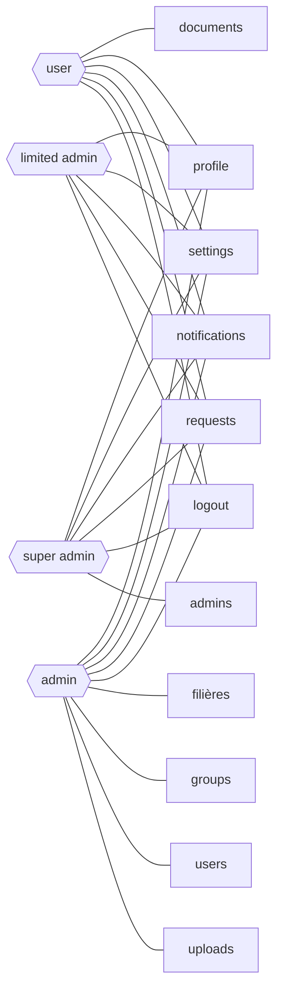

## use-case

```mermaid
graph LR
    user{{user}} --- documents
    user & admin{{admin}} & l-admin{{limited admin}} & s-admin{{super admin}} --- profile & settings & notifications & requests & logout
    admin --- filières & groups & users & uploads
    s-admin --- admins
    
    %% links
    click profile "/profile.md" _blank
    click settings "/settings.md" _blank
    click notifications "/notifications.md" _blank
    click requests "/requests.md" _blank
    click filières "/filières.md" _blank
    click groups "/groups.md" _blank
    click users "/users.md" _blank
    click uploads "/uploads.md" _blank
    click admins "/admins.md" _blank
```
