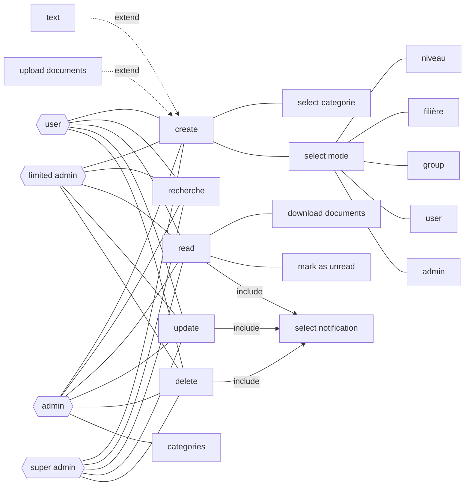

## use-case

```mermaid
graph LR
    user{{user}} & admin{{admin}} & l-admin{{limited admin}} & s-admin{{super admin}} --- nc[create] & nrr[recherche] & nr[read] & nu[update] & nd[delete]
    nc --- nsc[select categorie] & nsm[select mode]
    nsm --- ncn[niveau] & ncf[filière] & ncg[group] & ncs[user] & nca[admin]
    text & nud[upload documents] -.-> |extend| nc
    nr --- nddd[download documents] & nmau[mark as unread]
    nr & nu & nd --> |include| ns[select notification]
    admin --- categories
```
