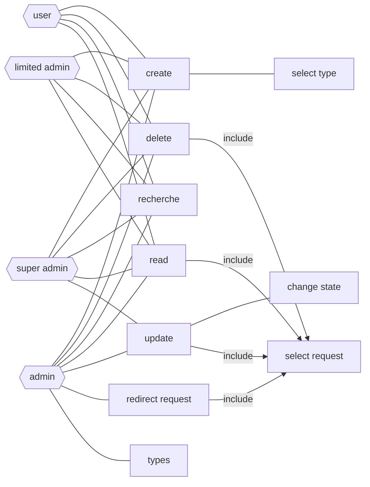

## use-case

```mermaid
graph LR
    user{{user}} & admin{{admin}} & l-admin{{limited admin}} & s-admin{{super admin}} --- rc[create] & rd[delete] & rrr[recherche] & rr[read]
    rc --- rst[select type]
    admin & s-admin --- ru[update]
    ru --- rcs[change state]
    admin --- rre[redirect request] & types
    rr & ru & rd & rre --> |include| rs[select request]
    
    %% links
    click types "https://github.com/idlli/laravel-project/blob/main/diagrams/types.md" _blank
```
