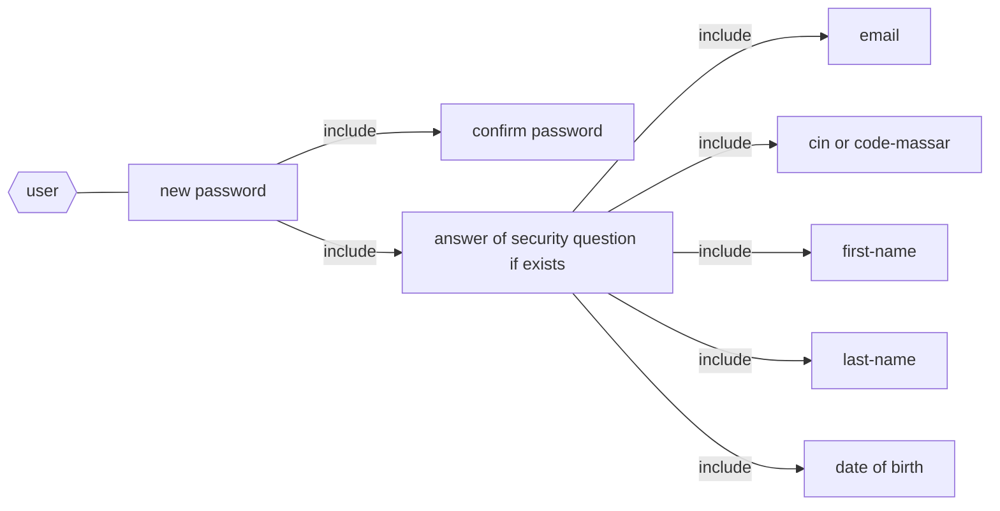
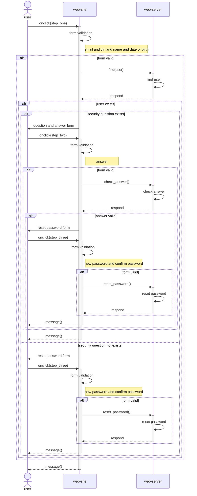

## use-case

```mermaid
graph LR
    user{{user}} --- n-password[new password]
    n-password --> |include| c-password[confirm password]
    n-password --> |include| answer[answer of security question if exists]
    answer --> |include| email
    answer --> |include| cin[cin or code-massar]
    answer --> |include| f-name[first-name]
    answer --> |include| l-name[last-name]
    answer --> |include| d-birth[date of birth]
```
## sequence

```mermaid
sequenceDiagram
    actor user
    participant site as web-site
    participant server as web-server
    user ->>+ site : onclick(step_one)
    site ->> site : form validation
    note right of site : email and cin and name and date of birth
    alt form valid
        site ->>+ server : find(user)
        server ->> server : find user
        server -->>- site : respond
        alt user exists
            alt security question exists
                site ->> user : question and answer form
                user ->>+ site : onclick(step_two)
                site ->> site : form validation
                note right of site : answer
                alt form valid
                    site ->>+ server : check_answer()
                    server ->> server : check answer
                    server -->>- site : respond
                    alt answer valid
                        site ->> user : reset password form
                        user ->>+ site : onclick(step_three)
                        site ->> site : form validation
                        note right of site : new password and confirm password
                        alt form valid
                            site ->>+ server : reset_password()
                            server ->> server : reset password
                            server -->>- site : respond
                        end
                        site -->>- user : message()
                    end 
                end
                site -->>- user : message()
            else security question not exists
                site ->> user : reset password form
                user ->>+ site : onclick(step_three)
                site ->> site : form validation
                note right of site : new password and confirm password
                alt form valid
                    site ->>+ server : reset_password()
                    server ->> server : reset password
                    server -->>- site : respond
                end
                site -->>- user : message()
            end
        end 
    end
    site -->>- user : message()
```
