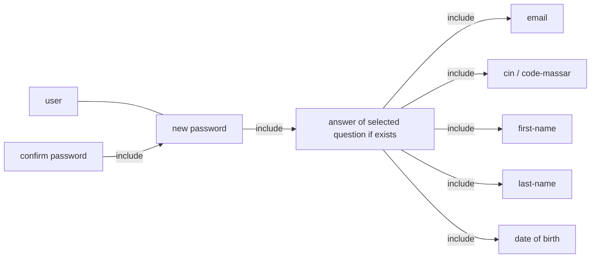

## use-case

```mermaid
graph LR
    user --- n-password[new password]
    c-password[confirm password] --> |include| n-password
    n-password --> |include| answer[answer of selected question if exists]
    answer --> |include| email
    answer --> |include| cin[cin / code-massar]
    answer --> |include| f-name[first-name]
    answer --> |include| l-name[last-name]
    answer --> |include| d-birth[date of birth]
```
