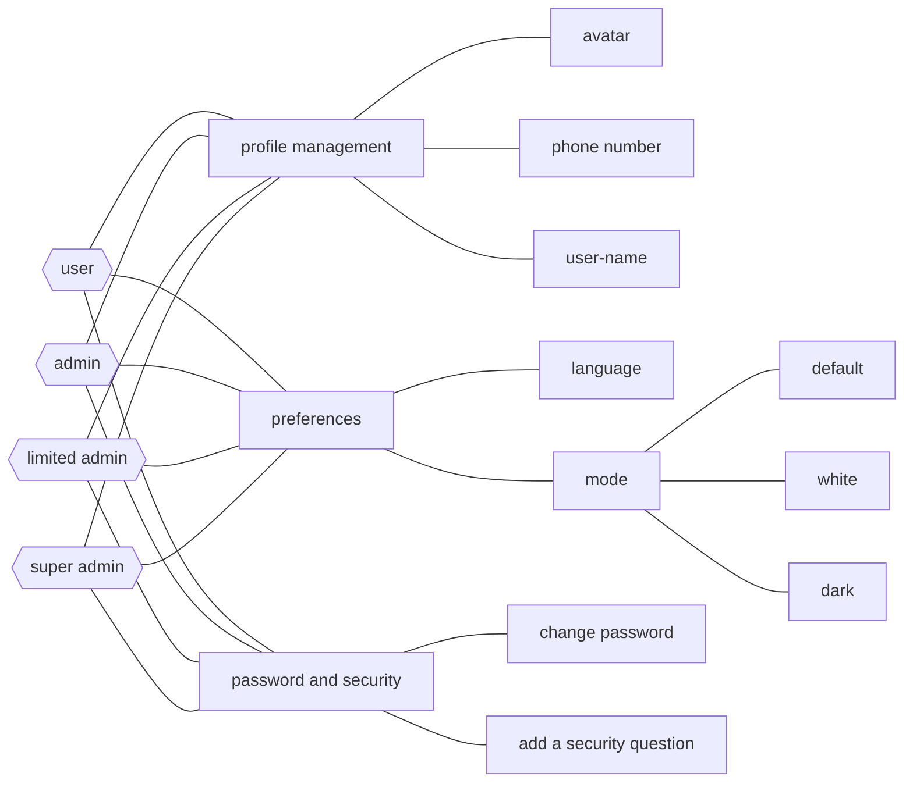

## use-case

```mermaid
graph LR
    user{{user}} & admin{{admin}} & l-admin{{limited admin}} & s-admin{{super admin}} --- pm[profile management]
    pm --- avatar
    pm --- p-number[phone number]
    pm --- u-name[user-name]
    user & admin & l-admin & s-admin --- preferences
    preferences --- language
    preferences --- mode
    mode --- default
    mode --- white
    mode --- dark
    user & admin & l-admin & s-admin --- ps[password and security]
    ps --- ch-password[change password]
    ps --- a-question[add a security question]
```
