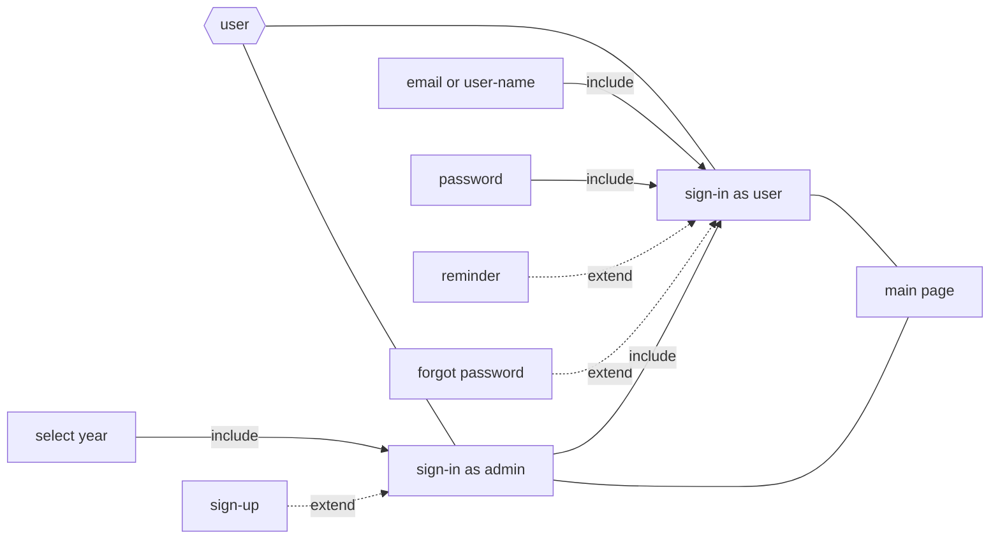

## use-case

```mermaid
graph LR
    user{{user}} --- as-user[sign-in as user]
    user --- as-admin[sign-in as admin]
    email[email or user-name] --> |include| as-user
    password --> |include| as-user
    reminder -.-> |extend| as-user
    f-password[forgot password] -.-> |extend| as-user
    as-admin --> |include| as-user
    s-year[select year] ---> |include| as-admin
    sign-up -.-> |extend| as-admin
    as-user & as-admin --- mp[main page]
```
