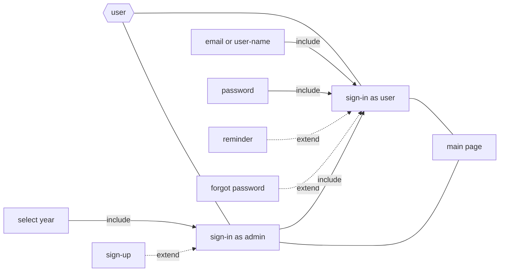
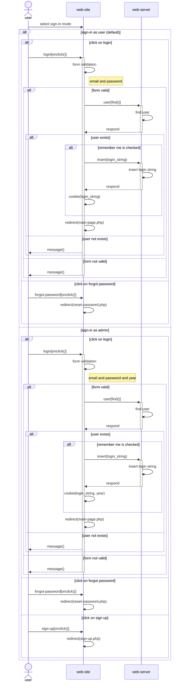

## use-case

```mermaid
graph LR
    user{{user}} --- as-user[sign-in as user]
    user --- as-admin[sign-in as admin]
    email[email or user-name] --> |include| as-user
    password --> |include| as-user
    reminder -.-> |extend| as-user
    f-password[forgot password] -.-> |extend| as-user
    as-admin --> |include| as-user
    s-year[select year] ---> |include| as-admin
    sign-up -.-> |extend| as-admin
    as-user & as-admin --- mp[main page]
    
    %% links
    click f-password "https://github.com/idlli/laravel-project/blob/main/diagrams/reset-password.md" _blank
    click sign-up "https://github.com/idlli/laravel-project/blob/main/diagrams/sign-up.md" _blank
    click mp "https://github.com/idlli/laravel-project/blob/main/diagrams/main-page.md" _blank
```
## sequence

```mermaid
sequenceDiagram
    actor user
    participant site as web-site
    participant server as web-server
    user ->> site : select sign-in mode
    alt sign-in as user (default)
        alt click on login
            user ->>+ site : login[onclick()]
            site ->> site : form validation
            note right of site : email and password
            alt form valid
                site ->>+ server : user[find()]
                server ->> server : find user
                server -->>- site : respond
                alt user exists
                    alt remember me is checked
                        site ->>+ server : insert(login_string)
                        server ->> server : insert login string
                        server -->>- site : respond
                        site ->> site : cookie(login_string)
                    end
                    site ->> site : redirect(main-page.php)
                else user not exists
                    site -->> user : message()
                end
            else form not valid
                site -->>- user : message()
            end
        else click on forgot password
            user ->> site : forgot-password[onclick()]
            site ->> site : redirect(reset-password.php)
        end
    else sign-in as admin
        alt click on login
            user ->>+ site : login[onclick()]
            site ->> site : form validation
            note right of site : email and password and year
            alt form valid
                site ->>+ server : user[find()]
                server ->> server : find user
                server -->>- site : respond
                alt user exists
                    alt remember me is checked
                        site ->>+ server : insert(login_string)
                        server ->> server : insert login string
                        server -->>- site : respond
                        site ->> site : cookie(login_string, year)
                    end
                    site ->> site : redirect(main-page.php)
                else user not exists
                    site -->> user : message()
                end
            else form not valid
                site -->>- user : message()
            end
        else click on forgot password
            user ->> site : forgot-password[onclick()]
            site ->> site : redirect(reset-password.php)
        else click on sign up
            user ->> site : sign-up[onclick()]
            site ->> site : redirect(sign-up.php)
        end
    end
```
