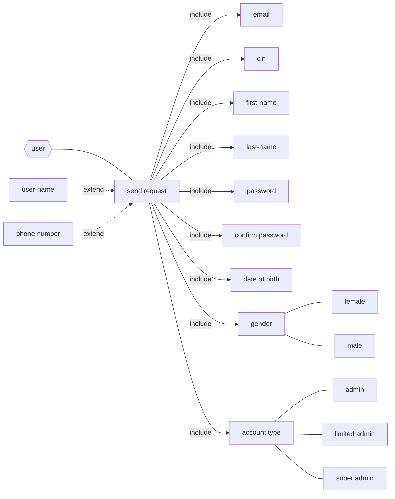
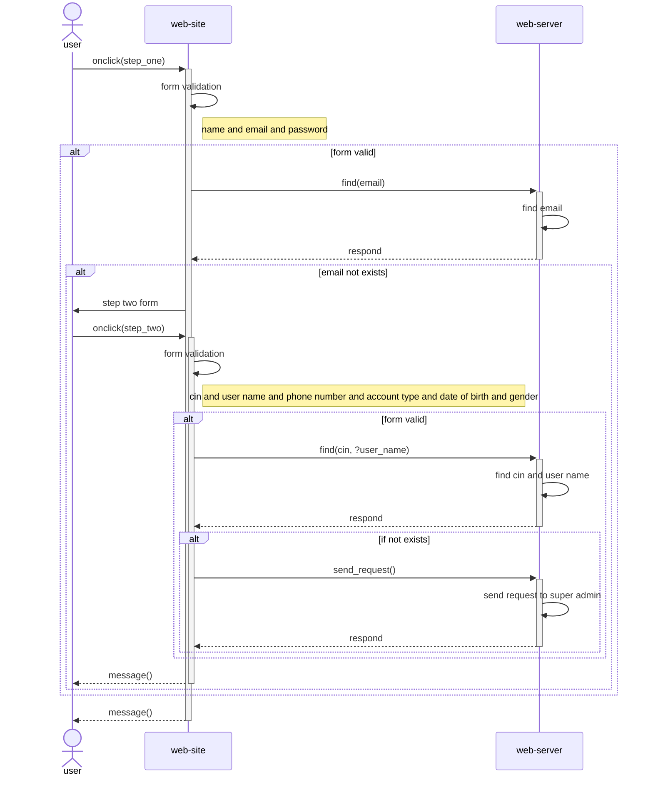

## use-case

```mermaid
graph LR
    user{{user}} --- s-request[send request]
    s-request --> |include| email
    s-request --> |include| cin
    s-request --> |include| f-name[first-name]
    s-request --> |include| l-name[last-name]
    s-request --> |include| password
    s-request --> |include| c-password[confirm password]
    s-request --> |include| d-birth[date of birth]
    s-request --> |include| gender
    gender --- female
    gender --- male
    s-request --> |include| a-type[account type]
    a-type --- admin[admin]
    a-type --- l-admin[limited admin]
    a-type --- s-admin[super admin]
    u-name[user-name] -.-> |extend| s-request
    p-number[phone number] -.-> |extend| s-request
```
## sequence

```mermaid
sequenceDiagram
    actor user
    participant site as web-site
    participant server as web-server
    user ->>+ site : onclick(step_one)
    site ->> site : form validation
    note right of site : name and email and password
    alt form valid
        site ->>+ server : find(email)
        server ->> server : find email
        server -->>- site : respond
        alt email not exists
            site ->> user : step two form
            user ->>+ site : onclick(step_two)
            site ->> site : form validation
            note right of site : cin and user name and phone number and account type and date of birth and gender
            alt form valid
                site ->>+ server : find(cin, ?user_name)
                server ->> server : find cin and user name
                server -->>- site : respond
                alt if not exists
                    site ->>+ server : send_request()
                    server ->> server : send request to super admin
                    server -->>- site : respond
                end
            end
            site -->>- user : message()
        end
    end
    site -->>- user : message()
```
