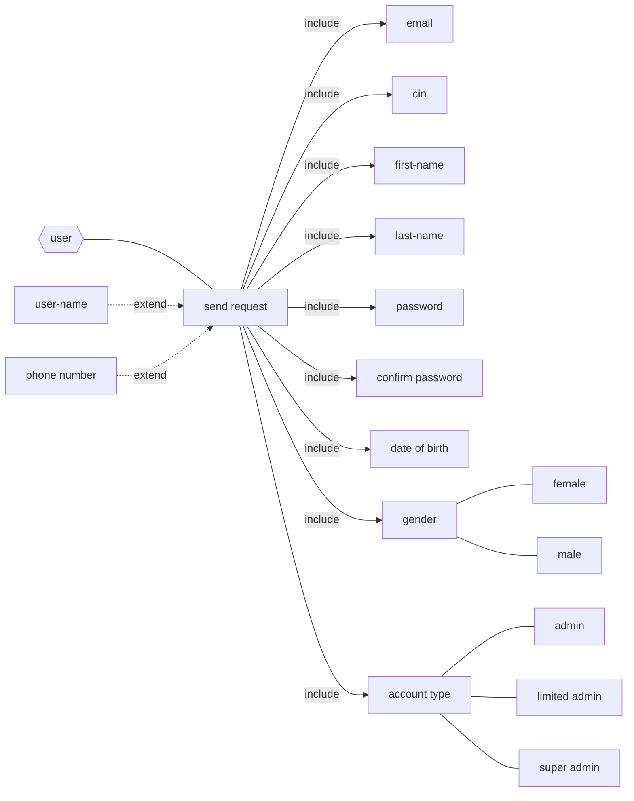

## use-case

```mermaid
graph LR
    user{{user}} --- s-request[send request]
    s-request --> |include| email
    s-request --> |include| cin
    s-request --> |include| f-name[first-name]
    s-request --> |include| l-name[last-name]
    s-request --> |include| password
    s-request --> |include| c-password[confirm password]
    s-request --> |include| d-birth[date of birth]
    s-request --> |include| gender
    gender --- female
    gender --- male
    s-request --> |include| a-type[account type]
    a-type --- admin[admin]
    a-type --- l-admin[limited admin]
    a-type --- s-admin[super admin]
    u-name[user-name] -.-> |extend| s-request
    p-number[phone number] -.-> |extend| s-request
```
