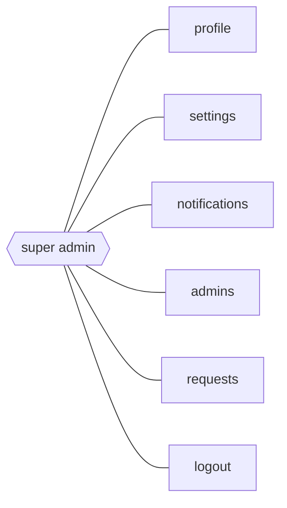
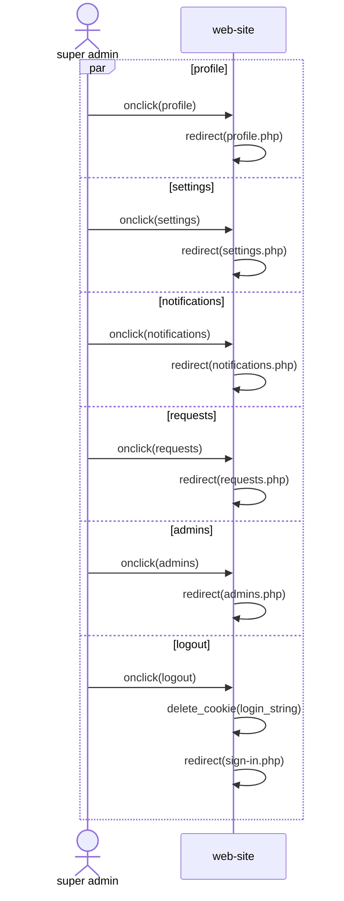

## use-case

```mermaid
graph LR
    s-admin{{super admin}} --- profile & settings & notifications & admins & requests & logout
    
    %% links
    
```
## sequence

```mermaid
sequenceDiagram
    actor sadmin as super admin
    participant site as web-site
    par profile
        sadmin ->> site : onclick(profile)
        site ->> site : redirect(profile.php)
    and settings
        sadmin ->> site : onclick(settings)
        site ->> site : redirect(settings.php)
    and notifications
        sadmin ->> site : onclick(notifications)
        site ->> site : redirect(notifications.php)
    and requests
        sadmin ->> site : onclick(requests)
        site ->> site : redirect(requests.php)
    and admins
        sadmin ->> site : onclick(admins)
        site ->> site : redirect(admins.php)
    and logout
        sadmin ->> site : onclick(logout)
        site ->> site : delete_cookie(login_string)
        site ->> site : redirect(sign-in.php)
    end
```
