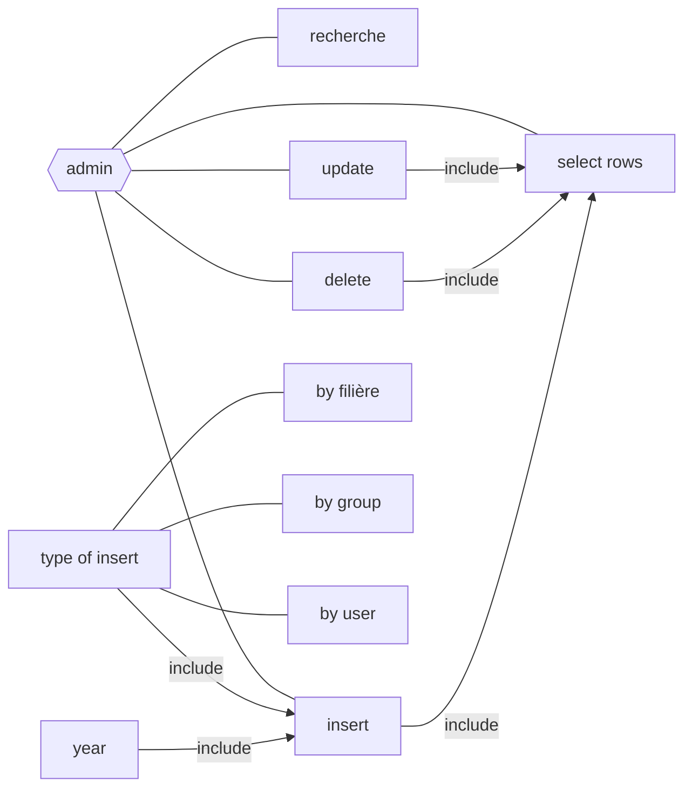

## use-case

```mermaid
graph LR
    admin{{admin}} --- uprr[recherche] & ups[select rows] & upu[update] & upd[delete] & upi[insert]
    upu & upd & upi --> |include| ups
    toi[type of insert] & syi[year] --> |include| upi
    toi --- ibf[by filière] & ibg[by group] & ibu[by user]
```
