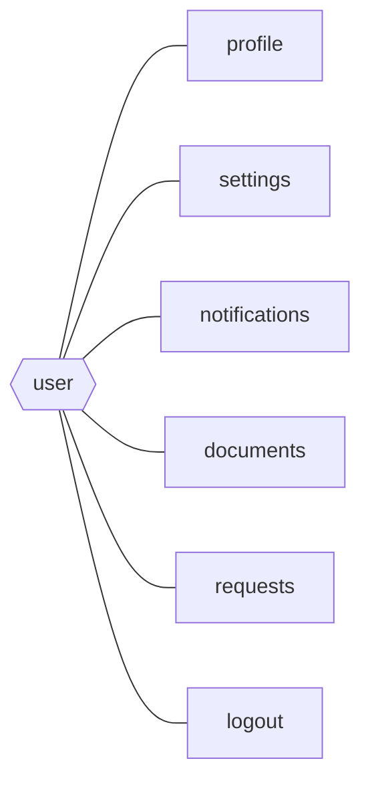
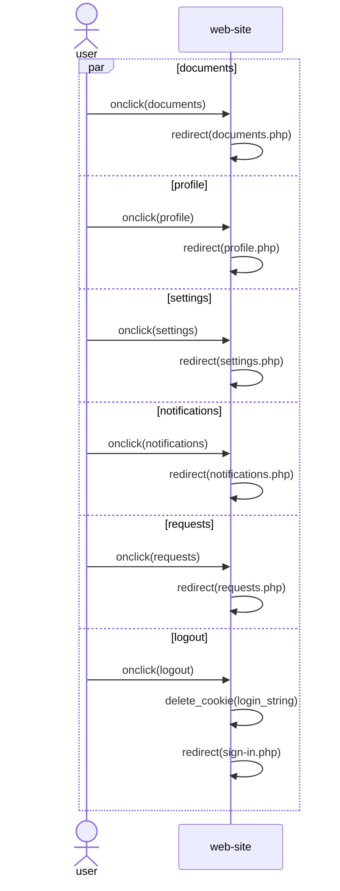

## use-case

```mermaid
graph LR
    user{{user}} ---  profile & settings & notifications & documents & requests & logout
    
    %% links
    
```
## sequence

```mermaid
sequenceDiagram
    actor user
    participant site as web-site
    par documents
        user ->> site : onclick(documents)
        site ->> site : redirect(documents.php)
    and profile
        user ->> site : onclick(profile)
        site ->> site : redirect(profile.php)
    and settings
        user ->> site : onclick(settings)
        site ->> site : redirect(settings.php)
    and notifications
        user ->> site : onclick(notifications)
        site ->> site : redirect(notifications.php)
    and requests
        user ->> site : onclick(requests)
        site ->> site : redirect(requests.php)
    and logout
        user ->> site : onclick(logout)
        site ->> site : delete_cookie(login_string)
        site ->> site : redirect(sign-in.php)
    end
```
