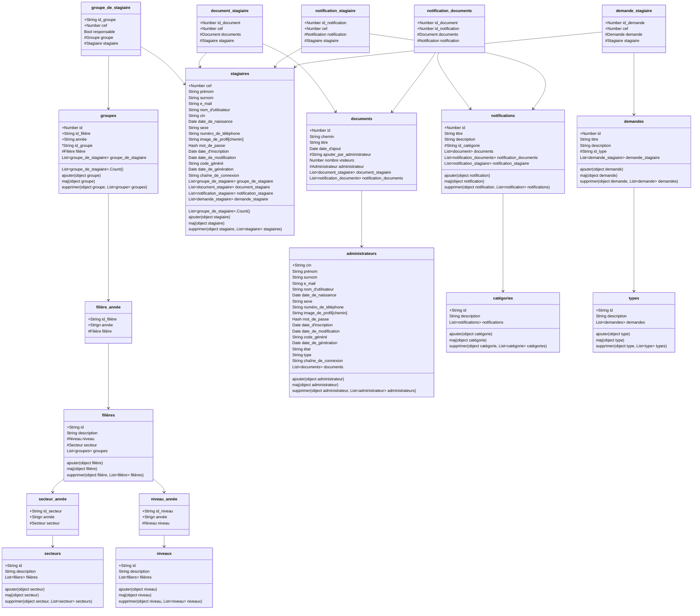

```mermaid
classDiagram
    class secteurs {
        +String id
        String description
        List~filiers~ filières
        ajouter(object secteur)
        maj(object secteur)
        supprimer(object secteur, List~secteur~ secteurs)
    }
    class niveaux {
        +String id
        String description
        List~filiers~ filières
        ajouter(object niveau)
        maj(object niveau)
        supprimer(object niveau, List~niveau~ niveaux)
    }
    class filières {
        +String id
        String description
        #Niveau niveau
        #Secteur secteur
        List~groupes~ groupes
        ajouter(object filière)
        maj(object filière)
        supprimer(object filière, List~filière~ filières)
    }
    class secteur_année {
        +String id_secteur
        +Strign année
        #Secteur secteur
    }
    class niveau_année {
        +String id_niveau
        +Strign année
        #Niveau niveau
    }
    class filière_année {
        +String id_filière
        +Strign année
        #Filière filière
    }
    secteur_année --> secteurs
    niveau_année --> niveaux
    filière_année --> filières
    filières --> secteur_année
    filières --> niveau_année
    class groupes {
        +Number id
        +String id_filière
        +String année
        *String id_groupe
        #Filière filière
        List~groupe_de_stagiaire~ groupe_de_stagiaire
        List~groupe_de_stagiaire~.Count()
        ajouter(object groupe)
        maj(object groupe)
        supprimer(object groupe, List~groupe~ groupes)
    }
    class stagiaires {
        +Number cef
        String prénom
        String surnom
        String e_mail
        String nom_d'utilisateur
        String cin
        Date date_de_naissance
        String sexe
        String numéro_de_téléphone
        String image_de_profil[chemin]
        Hash mot_de_passe
        Date date_d'inscription
        Date date_de_modification
        String code_généré
        Date date_de_génération
        String chaîne_de_connexion
        List~groupe_de_stagiaire~ groupe_de_stagiaire
        List~document_stagiaire~ document_stagiaire
        List~notification_stagiaire~ notification_stagiaire
        List~demande_stagiaire~ demande_stagiaire
        List~groupe_de_stagiaire~.Count()
        ajouter(object stagiaire)
        maj(object stagiaire)
        supprimer(object stagiaire, List~stagiaire~ stagiaires)
    }
    class groupe_de_stagiaire {
        +String id_groupe
        +Number cef
        Bool responsable
        #Groupe groupe
        #Stagiaire stagiaire
    }
    groupe_de_stagiaire --> groupes
    groupe_de_stagiaire --> stagiaires
    groupes --> filière_année
    class administrateurs {
        +String cin
        String prénom
        String surnom
        String e_mail
        String nom_d'utilisateur
        Date date_de_naissance
        String sexe
        String numéro_de_téléphone
        String image_de_profil[chemin]
        Hash mot_de_passe
        Date date_d'inscription
        Date date_de_modification
        String code_généré
        Date date_de_génération
        String état
        String type
        String chaîne_de_connexion
        List~documents~ documents
        ajouter(object administrateur)
        maj(object administrateur)
        supprimer(object administrateur, List~administrateur~ administrateurs)
    }
    class documents {
        +Number id
        String chemin
        String titre
        Date date_d'ajout
        #String ajouter_par_administrateur
        Number nombre visiteurs
        #Administrateur administrateur
        List~document_stagiaire~ document_stagiaire
        List~notification_documents~ notification_documents
    }
    class document_stagiaire {
        +Number id_document
        +Number cef
        #Document documents
        #Stagiaire stagiaire
    }
    documents --> administrateurs
    document_stagiaire --> stagiaires
    document_stagiaire --> documents
    class notification_documents {
        +Number id_document
        +Number id_notification
        #Document documents
        #Notification notification
    }
    notification_documents --> documents
    notification_documents --> notifications
    class notification_stagiaire {
        +Number id_notification
        +Number cef
        #Notification notification
        #Stagiaire stagiaire
    }
    notification_stagiaire --> notifications
    notification_stagiaire --> stagiaires
    class notifications {
        +Number id
        String titre
        String description
        #String id_catégorie
        List~document~ documents
        List~notification_documents~ notification_documents
        List~notification_stagiaire~ notification_stagiaire
        ajouter(object notification)
        maj(object notification)
        supprimer(object notification, List~notification~ notifications)
    }
    notifications --> catégories
    class catégories {
        +String id
        String description
        List~notifications~ notifications
        ajouter(object catégorie)
        maj(object catégorie)
        supprimer(object catégorie, List~catégorie~ catégories)
    }
    class demande_stagiaire {
        +Number id_demande
        +Number cef
        #Demande demande
        #Stagiaire stagiaire
    }
    demande_stagiaire --> demandes
    demande_stagiaire --> stagiaires
    class demandes {
        +Number id
        String titre
        String description
        #String id_type
        List~demande_stagiaire~ demande_stagiaire
        ajouter(object demande)
        maj(object demande)
        supprimer(object demande, List~demande~ demandes)
    }
    demandes --> types
    class types {
        +String id
        String description
        List~demandes~ demandes
        ajouter(object type)
        maj(object type)
        supprimer(object type, List~type~ types)
    }
```
