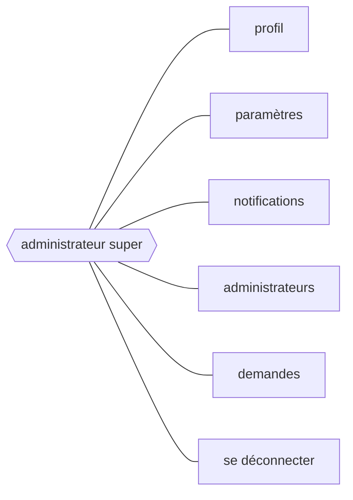
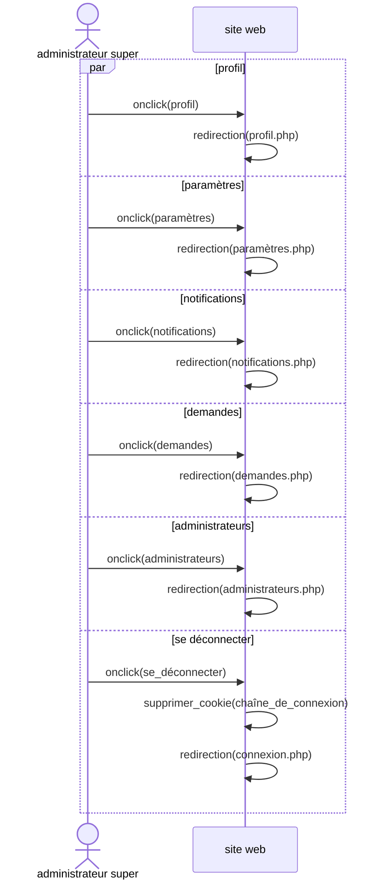

## cas d'utilisation

```mermaid
graph LR
    administrateur-s{{administrateur super}} --- profil & paramètres & notifications & administrateurs & demandes & déconnecter[se déconnecter]
```
## séquence

```mermaid
sequenceDiagram
    actor administrateur_s as administrateur super
    participant site as site web
    par profil
        administrateur_s ->> site : onclick(profil)
        site ->> site : redirection(profil.php)
    and paramètres
        administrateur_s ->> site : onclick(paramètres)
        site ->> site : redirection(paramètres.php)
    and notifications
        administrateur_s ->> site : onclick(notifications)
        site ->> site : redirection(notifications.php)
    and demandes
        administrateur_s ->> site : onclick(demandes)
        site ->> site : redirection(demandes.php)
    and administrateurs
        administrateur_s ->> site : onclick(administrateurs)
        site ->> site : redirection(administrateurs.php)
    and se déconnecter
        administrateur_s ->> site : onclick(se_déconnecter)
        site ->> site : supprimer_cookie(chaîne_de_connexion)
        site ->> site : redirection(connexion.php)
    end
```
