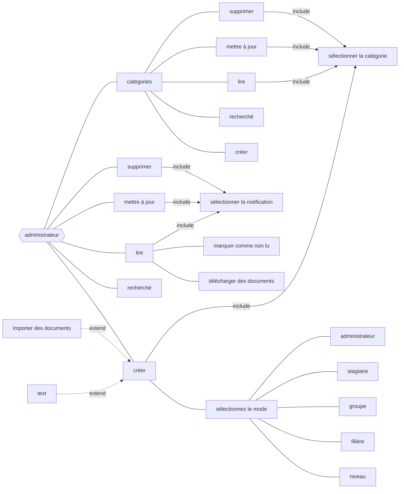
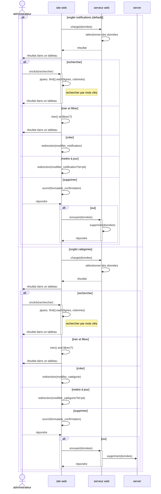

## cas d'utilisation

```mermaid
graph LR
    administrateur{{administrateur}} --- nc[créer] & nr[recherché] & nl[lire] & nm[mettre à jour] & ns[supprimer] & catégories
    nc --- nsm[sélectionnez le mode]
    nsm --- ncn[niveau] & ncf[filière] & ncg[groupe] & ncs[stagiaire] & nca[administrateur]
    text & nud[importer des documents] -.-> |extend| nc
    nl --- nddd[télécharger des documents] & nmau[marquer comme non lu]
    nl & nm & ns --> |include| nss[sélectionner la notification]
    catégories --- cc[créer] & cr[recherché] & cl[lire] & cm[mettre à jour] & cs[supprimer]
    nc & cl & cm & cs --> |include| nsc[sélectionner la catégorie]
```
## séquence

```mermaid
sequenceDiagram
    actor administrateur
    participant site as site web
    participant serveur as serveur web
    alt onglet notifications (default)
        site ->> serveur : charge(données)
        serveur ->> serveur : sélectionner des données
        serveur -->> site : résultat
        site ->> administrateur : résultat dans un tableau
        alt rechercher
            administrateur ->>+ site : onclick(rechercher)
            site ->> site : jquery .find().each(lignes, colonnes)
            note right of site : rechercher par mots clés
            site -->>- administrateur : résultat dans un tableau
        else trier et filtrer
            site ->> site : trier() et filtrer(?)
            site ->> administrateur : résultat dans un tableau
        else créer
            site ->> site : redirection(modifier_notification)
        else mettre à jour
            site ->> site : redirection(modifier_notification?id=pk)
        else supprimer
            site ->> site : ouvrir(formulaire_confirmation)
            administrateur -->> site : répondre
            alt oui
                site ->>+ serveur : envoyer(données)
                serveur ->> serveur : supprimer(données)
                serveur -->>- site : répondre
            end
        end
    else onglet catégories
        site ->> serveur : charge(données)
        serveur ->> serveur : sélectionner des données
        serveur -->> site : résultat
        site ->> administrateur : résultat dans un tableau
        alt rechercher
            administrateur ->>+ site : onclick(rechercher)
            site ->> site : jquery .find().each(lignes, colonnes)
            note right of site : rechercher par mots clés
            site -->>- administrateur : résultat dans un tableau
        else trier et filtrer
            site ->> site : trier() and filtrer(?)
            site ->> administrateur : résultat dans un tableau
        else créer
            site ->> site : redirection(modifier_catégorie)
        else mettre à jour
            site ->> site : redirection(modifier_catégorie?id=pk)
        else supprimer
            site ->> site : ouvrir(formulaire_confirmation)
            administrateur -->> site : répondre
            alt oui
                site ->>+ serveur : envoyer(données)
                serveur ->> server : supprimer(données)
                serveur -->>- site : répondre
            end
        end
    end
```
