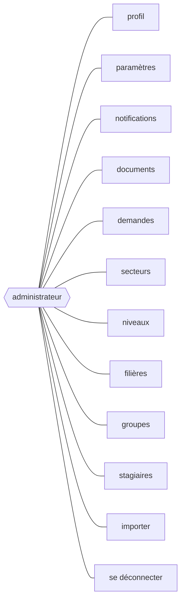
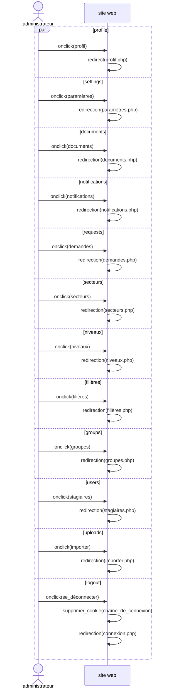

## cas d'utilisation

```mermaid
graph LR
    administrateur{{administrateur}} --- profil & paramètres & notifications & documents & demandes & secteurs & niveaux & filières & groupes & stagiaires & importer & déconnecter[se déconnecter]
```
## séquence

```mermaid
sequenceDiagram
    actor administrateur
    participant site as site web
    par profile
        administrateur ->> site : onclick(profil)
        site ->> site : redirect(profil.php)
    and settings
        administrateur ->> site : onclick(paramètres)
        site ->> site : redirection(paramètres.php)
    and documents
        administrateur ->> site : onclick(documents)
        site ->> site : redirection(documents.php)
    and notifications
        administrateur ->> site : onclick(notifications)
        site ->> site : redirection(notifications.php)
    and requests
        administrateur ->> site : onclick(demandes)
        site ->> site : redirection(demandes.php)
    and secteurs
        administrateur ->> site : onclick(secteurs)
        site ->> site : redirection(secteurs.php)
    and niveaux
        administrateur ->> site : onclick(niveaux)
        site ->> site : redirection(niveaux.php)
    and filières
        administrateur ->> site : onclick(filières)
        site ->> site : redirection(filières.php)
    and groups
        administrateur ->> site : onclick(groupes)
        site ->> site : redirection(groupes.php)
    and users
        administrateur ->> site : onclick(stagiaires)
        site ->> site : redirection(stagiaires.php)
    and uploads
        administrateur ->> site : onclick(importer)
        site ->> site : redirection(importer.php)
    and logout
        administrateur ->> site : onclick(se_déconnecter)
        site ->> site : supprimer_cookie(chaîne_de_connexion)
        site ->> site : redirection(connexion.php)
    end
```
