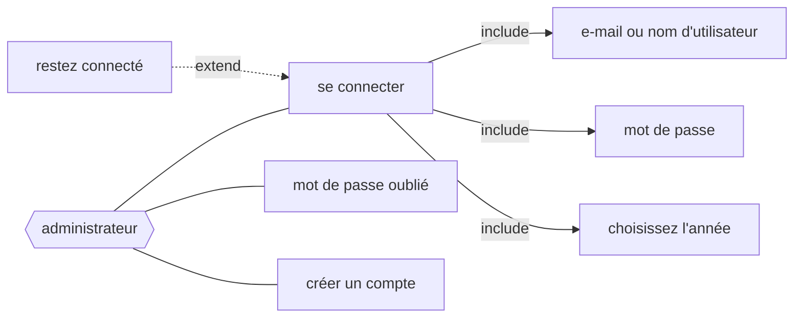
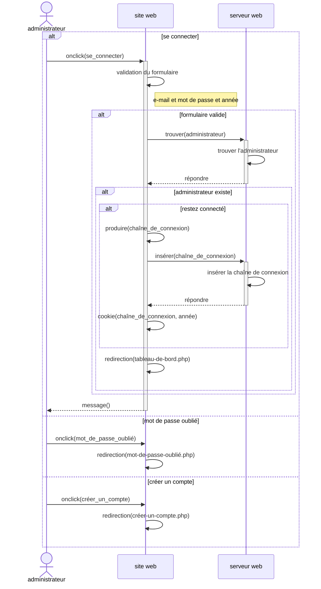

## cas d'utilisation

```mermaid
graph LR
    administrateur{{administrateur}} --- connexion[se connecter] & passe-o[mot de passe oublié] & créer[créer un compte]
    connexion --> |include| e-mail[e-mail ou nom d'utilisateur] & passe[mot de passe] & année[choisissez l'année]
    restez[restez connecté] -.-> |extend| connexion
    
    %% liens
    click passe-o "https://github.com/idlli/projet-de-stage/blob/main/uml/authentification/mot-de-passe-oublié.md" _blank
    click créer "https://github.com/idlli/projet-de-stage/blob/main/uml/authentification/créer-un-compte.md" _blank
```
## séquence

```mermaid
sequenceDiagram
    actor administrateur
    participant site as site web
    participant serveur as serveur web
    alt se connecter
        administrateur ->>+ site : onclick(se_connecter)
        site ->> site : validation du formulaire
        note right of site : e-mail et mot de passe et année
        alt formulaire valide
            site ->>+ serveur : trouver(administrateur)
            serveur ->> serveur : trouver l'administrateur
            serveur -->>- site : répondre
            alt administrateur existe
                alt restez connecté
                    site ->> site : produire(chaîne_de_connexion)
                    site ->>+ serveur : insérer(chaîne_de_connexion)
                    serveur ->> serveur : insérer la chaîne de connexion
                    serveur -->>- site : répondre
                    site ->> site : cookie(chaîne_de_connexion, année)
                end
                site ->> site : redirection(tableau-de-bord.php)
            end
        end
        site -->>- administrateur : message()
    else mot de passe oublié
        administrateur ->> site : onclick(mot_de_passe_oublié)
        site ->> site : redirection(mot-de-passe-oublié.php)
    else créer un compte
        administrateur ->> site : onclick(créer_un_compte)
        site ->> site : redirection(créer-un-compte.php)
    end
```
