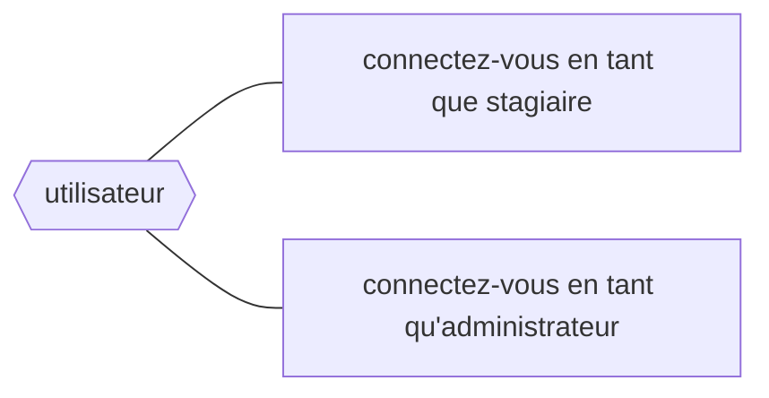
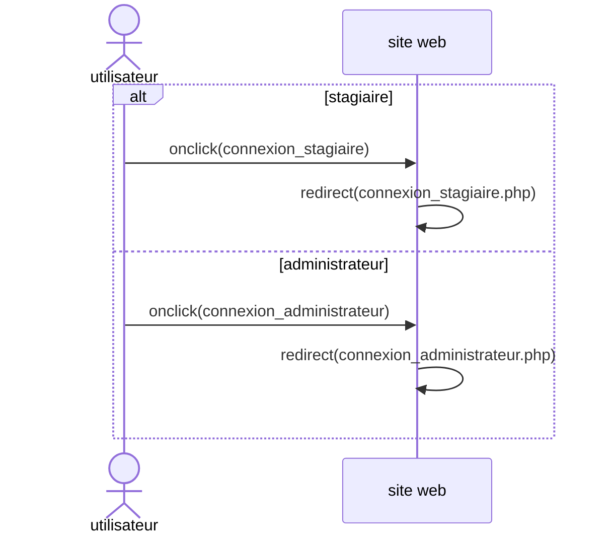

## cas d'utilisation

```mermaid
graph LR
    utilisateur{{utilisateur}} --- connexion-stagiaire[connectez-vous en tant que stagiaire] & connexion-administrateur[connectez-vous en tant qu'administrateur]
    
    %% liens
    click connexion-stagiaire "https://github.com/idlli/projet-de-stage/blob/main/uml/authentification/connexion-stagiaire.md" _blank
    click connexion-administrateur "https://github.com/idlli/projet-de-stage/blob/main/uml/authentification/connexion-administrateur.md" _blank
```
## séquence

```mermaid
sequenceDiagram
    actor utilisateur
    participant site as site web
    alt stagiaire
        utilisateur ->> site : onclick(connexion_stagiaire)
        site ->> site : redirect(connexion_stagiaire.php)
    else administrateur
        utilisateur ->> site : onclick(connexion_administrateur)
        site ->> site : redirect(connexion_administrateur.php)
    end
```
