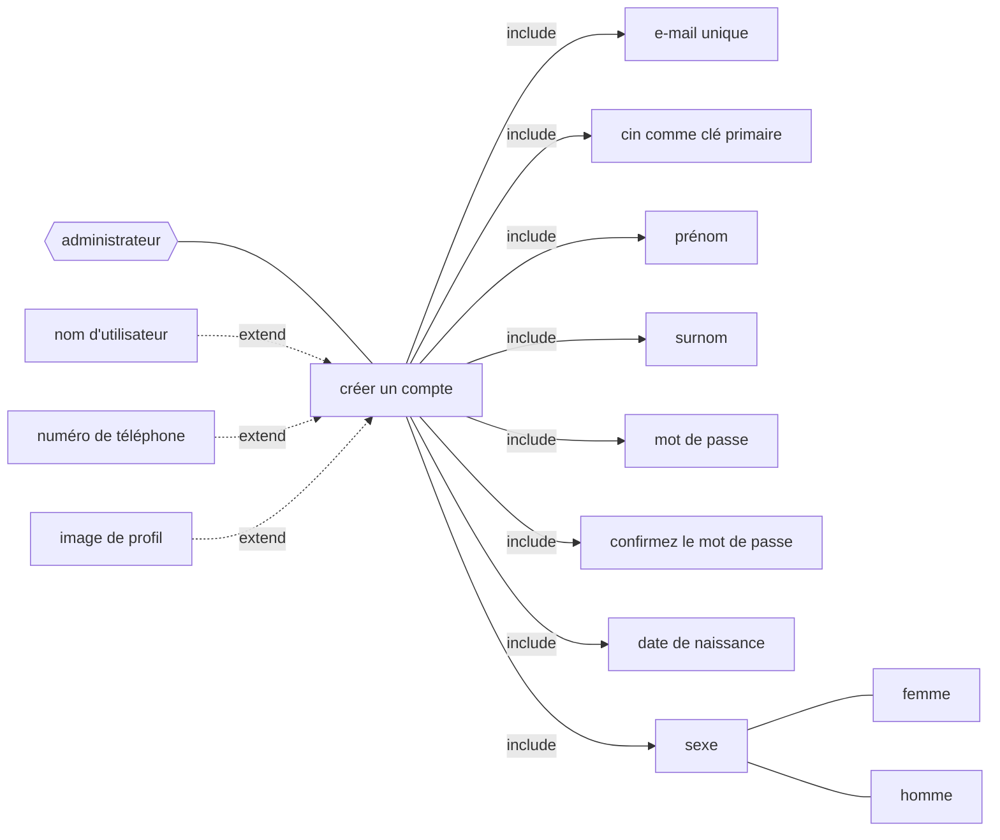
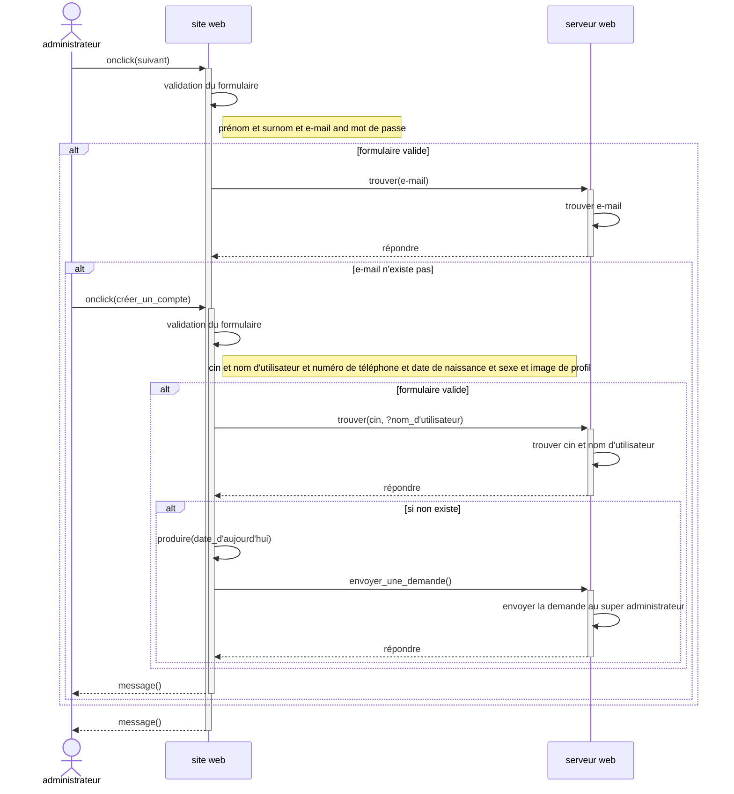

## cas d'utilisation

```mermaid
graph LR
    administrateur{{administrateur}} --- créer[créer un compte]
    créer --> |include| e-mail[e-mail unique] & cin[cin comme clé primaire] & prénom & surnom & passe[mot de passe] & passe-c[confirmez le mot de passe] & date-n[date de naissance] & sexe
    sexe --- femme & homme    
    nom-u[nom d'utilisateur] & numéro-t[numéro de téléphone] & avatar[image de profil] -.-> |extend| créer
    
    %% EFP ?
```
## séquence

```mermaid
sequenceDiagram
    actor administrateur
    participant site as site web
    participant serveur as serveur web
    administrateur ->>+ site : onclick(suivant)
    site ->> site : validation du formulaire
    note right of site : prénom et surnom et e-mail and mot de passe
    alt formulaire valide
        site ->>+ serveur : trouver(e-mail)
        serveur ->> serveur : trouver e-mail
        serveur -->>- site : répondre
        alt e-mail n'existe pas
            administrateur ->>+ site : onclick(créer_un_compte)
            site ->> site : validation du formulaire
            note right of site : cin et nom d'utilisateur et numéro de téléphone et date de naissance et sexe et image de profil
            alt formulaire valide
                site ->>+ serveur : trouver(cin, ?nom_d'utilisateur)
                serveur ->> serveur : trouver cin et nom d'utilisateur
                serveur -->>- site : répondre
                alt si non existe
                    site ->> site : produire(date_d'aujourd'hui)
                    site ->>+ serveur : envoyer_une_demande()
                    serveur ->> serveur : envoyer la demande au super administrateur
                    serveur -->>- site : répondre
                end
            end
            site -->>- administrateur : message()
        end
    end
    site -->>- administrateur : message()
```
