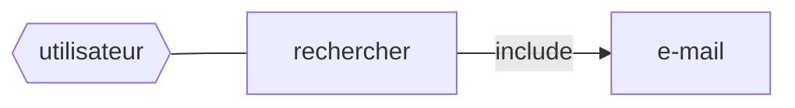
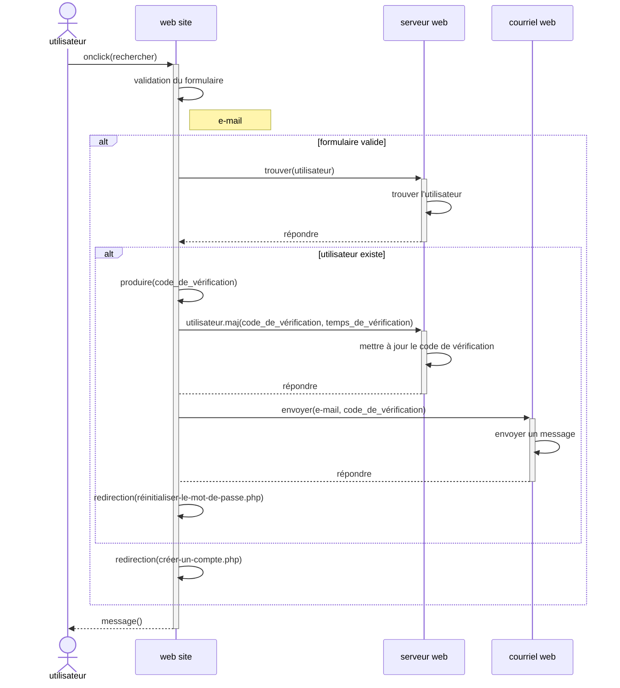

## cas d'utilisation

```mermaid
graph LR
    utilisateur{{utilisateur}} --- rechercher
    rechercher --> |include| e-mail
```
## séquence

```mermaid
sequenceDiagram
    actor utilisateur
    participant site as web site
    participant serveur as serveur web
    participant courriel as courriel web
    utilisateur ->>+ site : onclick(rechercher)
    site ->> site : validation du formulaire
    note right of site : e-mail
    alt formulaire valide
        site ->>+ serveur : trouver(utilisateur)
        serveur ->> serveur : trouver l'utilisateur
        serveur -->>- site : répondre
        alt utilisateur existe
            site ->> site : produire(code_de_vérification)
            site ->>+ serveur : utilisateur.maj(code_de_vérification, temps_de_vérification)
            serveur ->> serveur : mettre à jour le code de vérification
            serveur -->- site : répondre
            site ->>+ courriel : envoyer(e-mail, code_de_vérification)
            courriel ->> courriel : envoyer un message
            courriel -->- site : répondre
            site ->> site : redirection(réinitialiser-le-mot-de-passe.php)
        end
        site ->> site : redirection(créer-un-compte.php)
    end
    site -->>- utilisateur : message()
```
