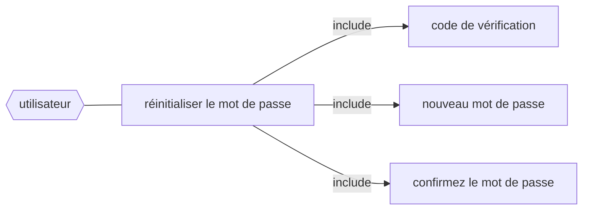
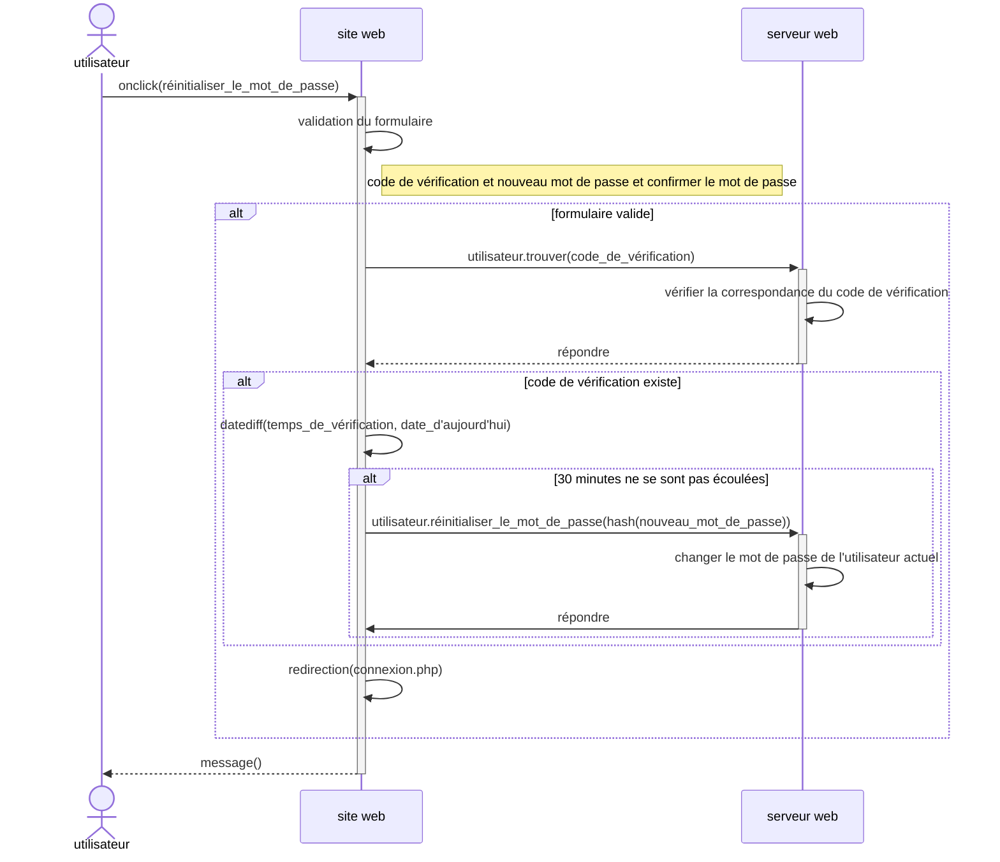

## cas d'utilisation

```mermaid
graph LR
    utilisateur{{utilisateur}} --- passe-r[réinitialiser le mot de passe]
    passe-r --> |include| code[code de vérification] & passe-n[nouveau mot de passe] & passe-c[confirmez le mot de passe]
```
## séquence

```mermaid
sequenceDiagram
    actor utilisateur
    participant site as site web
    participant serveur as serveur web
    utilisateur ->>+ site : onclick(réinitialiser_le_mot_de_passe)
    site ->> site : validation du formulaire
    note right of site : code de vérification et nouveau mot de passe et confirmer le mot de passe
    alt formulaire valide
        site ->>+ serveur : utilisateur.trouver(code_de_vérification)
        serveur ->> serveur : vérifier la correspondance du code de vérification
        serveur -->>- site : répondre
        alt code de vérification existe
            site ->> site : datediff(temps_de_vérification, date_d'aujourd'hui)
            alt 30 minutes ne se sont pas écoulées
                site ->>+ serveur : utilisateur.réinitialiser_le_mot_de_passe(hash(nouveau_mot_de_passe))
                serveur ->> serveur : changer le mot de passe de l'utilisateur actuel
                serveur ->>- site : répondre
            end
        end
        site ->> site : redirection(connexion.php)
    end
    site -->>- utilisateur : message()
```
