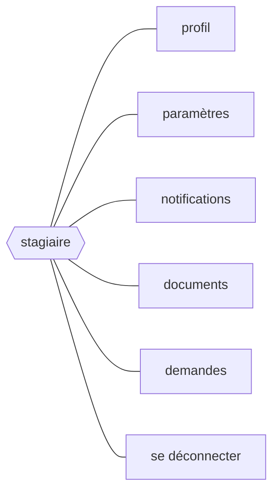
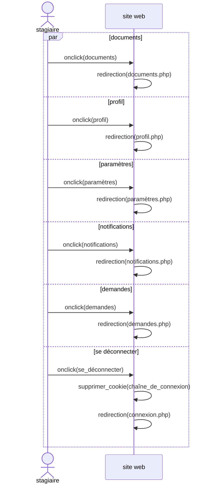

## cas d'utilisation

```mermaid
graph LR
    stagiaire{{stagiaire}} ---  profil & paramètres & notifications & documents & demandes & déconnecter[se déconnecter]
```
## séquence

```mermaid
sequenceDiagram
    actor stagiaire
    participant site as site web
    par documents
        stagiaire ->> site : onclick(documents)
        site ->> site : redirection(documents.php)
    and profil
        stagiaire ->> site : onclick(profil)
        site ->> site : redirection(profil.php)
    and paramètres
        stagiaire ->> site : onclick(paramètres)
        site ->> site : redirection(paramètres.php)
    and notifications
        stagiaire ->> site : onclick(notifications)
        site ->> site : redirection(notifications.php)
    and demandes
        stagiaire ->> site : onclick(demandes)
        site ->> site : redirection(demandes.php)
    and se déconnecter
        stagiaire ->> site : onclick(se_déconnecter)
        site ->> site : supprimer_cookie(chaîne_de_connexion)
        site ->> site : redirection(connexion.php)
    end
```
